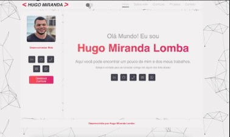

# Portfolio/Site Pessoal

Site pessoal com informações sobre mim e meus trabalhos.
Desenvolvi esse site para divulgar meus trabalhos e minhas iformações pessoais.

Esse projeto foi uma oportunidade para colocar em prática os conhecimentos de React que venho aprendendo no bootcamp de Desenvolvimento Web da Ironhack, adquirir e testar novos conhecimentos.

## Características

- Aplicação responsiva;
- Modo Claro/Escuro
- Animação na foto de perfil ao trocar de tema
- Mensagem ao identificar a intenção de saída da página

